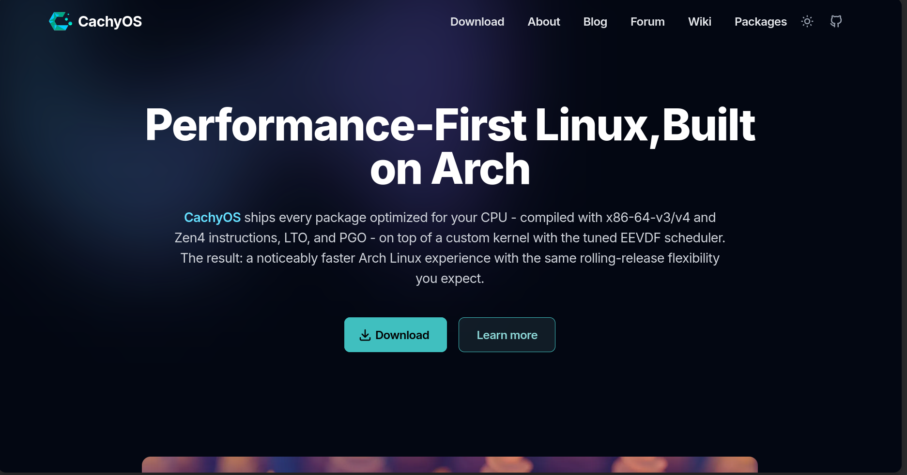
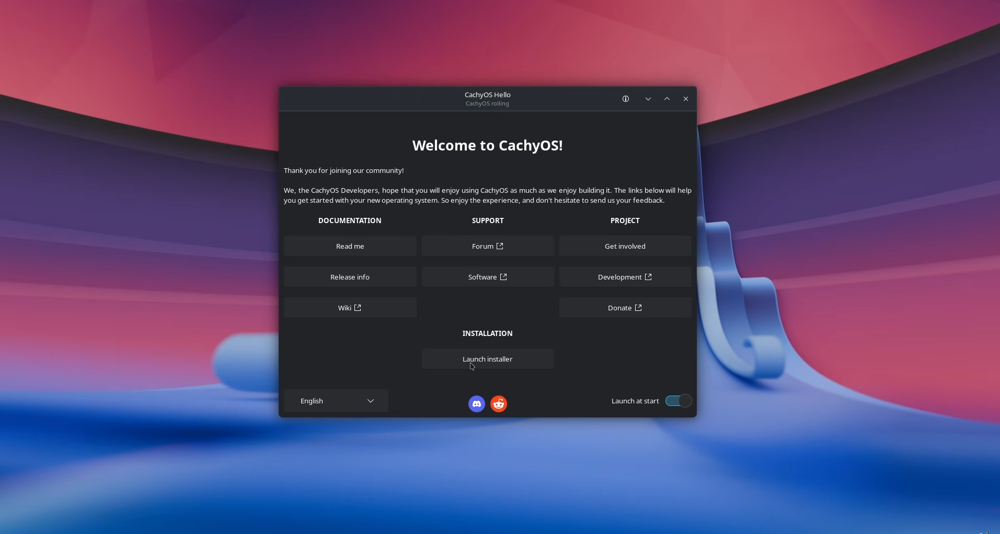
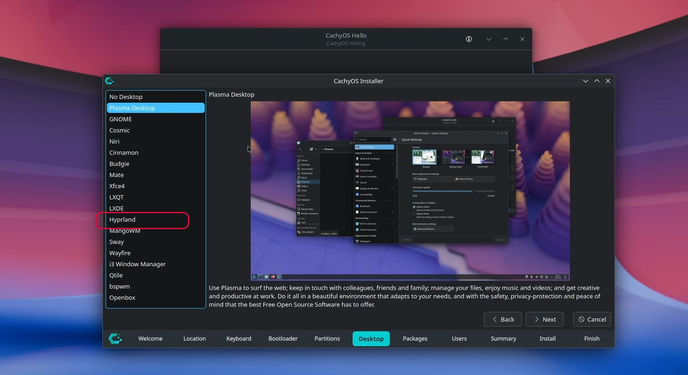

# CachyOS + Hyprland + Noctelia Installation Guide

<p align="center">
  
  
  
</p>

This guide explains the simple and clean way to install CachyOS, select Hyprland during installation, and have Noctelia ready after the system is installed.



## Overview

CachyOS is a fast, Arch-based Linux distribution optimized for performance. Hyprland is a lightweight and modern Wayland compositor. Noctelia is a sleek theme and dotfiles setup commonly used with Hyprland.

The goal is simple:

1. Download the CachyOS ISO
2. Boot from USB
3. Install CachyOS and select Hyprland
4. Finish the installation and wait for the desktop to be ready
5. Use Noctelia on the installed system

## Requirements

Before starting, make sure you have:

- A USB drive with at least 8 GB of space
- An internet connection
- A system with UEFI enabled
- Enough free disk space for the installation

## Step-by-step installation

### 1) Download the ISO

Go to the official website:

- https://cachyos.org/
- https://wiki.cachyos.org/

Download the desktop version. If a Hyprland edition is available, use it.

### 2) Create the bootable USB

Use a tool like:

- BalenaEtcher
- Ventoy
- Rufus (for Windows)

On Linux, you can also use:

```bash
sudo dd if=cachyos.iso of=/dev/sdX bs=4M status=progress oflag=sync
```

Replace `/dev/sdX` with your USB device. Be careful not to overwrite the wrong disk.

### 3) Boot from USB

1. Insert the USB drive.
2. Restart the computer.
3. Open BIOS/UEFI settings (`F2`, `F10`, `F12`, `Del`, or `Esc`, depending on the motherboard).
4. Select the USB device as the boot drive.
5. Start the CachyOS live environment.

### 4) Start the installer

Once the live environment loads:

- Choose the keyboard layout
- Connect to the internet
- Open the installer from the desktop or application menu



### 5) Select Hyprland during installation

When the installer asks which desktop environment to install, select Hyprland.

This is the key step. If you choose Hyprland here, the system installs correctly for this setup.



### 6) Install the system

Use the default installation flow if you are not advanced.

For UEFI systems, the installer usually creates the required EFI partition automatically.

Important:

- If your EFI partition is too small or missing, create a FAT32 EFI partition of around 1 GB in Windows if needed.
- Do not create extra unnecessary EFI partitions.
- Use the default option unless you know exactly what you are doing.

Typical layout:

```text
/dev/nvme0n1
├── /boot/efi     1G     FAT32
├── /             rest   ext4 or btrfs
└── swap          optional
```

Set your username, password, timezone, and hostname.

### 7) Finish the installation and wait

After the installation finishes:

1. Reboot the system
2. Boot into the new CachyOS installation
3. Wait for Hyprland to load
4. Once the desktop appears and is stable, the setup is complete

At this point, the system is installed and Hyprland is already working.

Noctelia is ready to be used after the desktop environment is up and running.

## Notes

- If the EFI partition is not enough, create a 1 GB FAT32 EFI partition in Windows and let the installer use it.
- Do not create unnecessary partitions.
- The basic idea is: install CachyOS, select Hyprland, reboot, and wait until the system is ready.
- After that, the setup is considered complete.

## Useful links

- CachyOS: https://cachyos.org/
- CachyOS Wiki: https://wiki.cachyos.org/
- Hyprland: https://hyprland.org/

## Final note

This is the clean and simple installation flow: download CachyOS, boot from USB, select Hyprland, install, restart, and wait until the system is ready. That is the correct process for a proper Hyprland setup.
