# Spacewar Online-Fix Setup Guide
A comprehensive guide to setting up Online-Fix for Spacewar on Linux.

## Resources for launcher
- [Online-Fix GitHub Repository for downloading Launcher](https://github.com/ZzEdovec/onlinefix-linux)
- [Online-Fix Official Website for downloading Launcher](https://zzedovec.github.io/index_en.html)

## Prerequisites
Before proceeding, ensure you have the following applications installed:
- **qBittorrent** — for torrent file management
- **Lutris** — for game compatibility

Both applications can be installed via your system's package manager or Flatpak.

## Installation Steps

### Step 1: Download Online-Fix Launcher
Download the Online-Fix Launcher from the launchedowload  folder at the top

### Step 2: Set Execute Permissions
1. Open the file manager and right-click the `onlinefix_launcher` file
2. Select **Properties**
3. Go to **Permissions** and enable "Allow executing file as program"

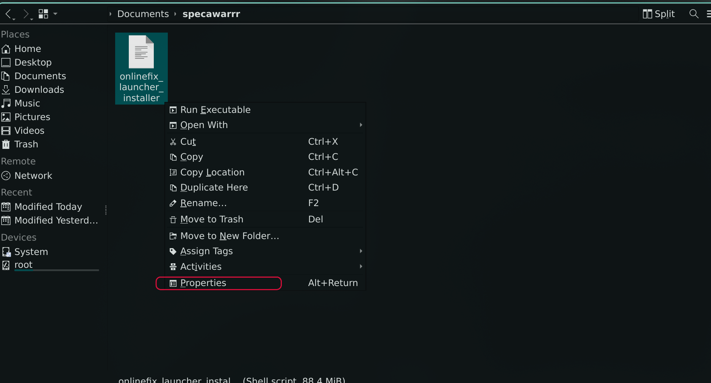
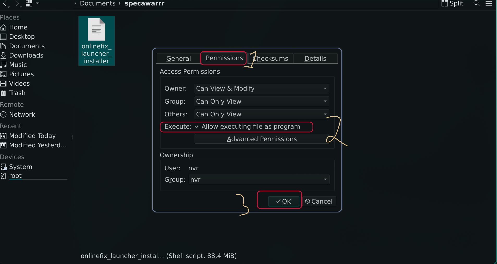

### Step 3: Launch the Installer
Double-click `OnlineFix_launcher` and click "Download"

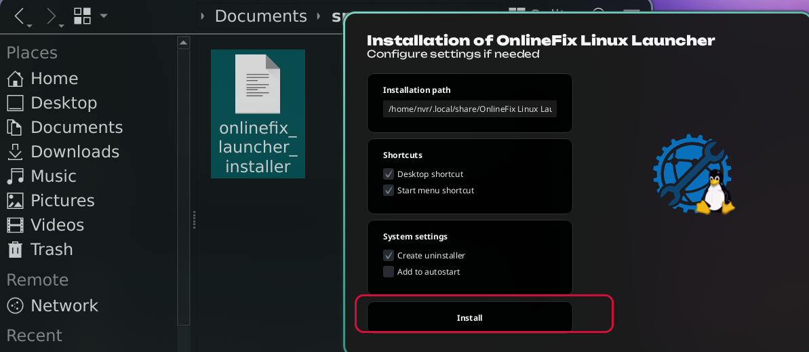
If did't Open rigth click the anywhere and click Open terminal here and paste this
```bash
chmod +x onlinefix_launcher_installer && ./onlinefix_launcher_installer
```
### Step 4: Open Steam and Launch Online-Fix
Open Steam first, then launch the Online-Fix program

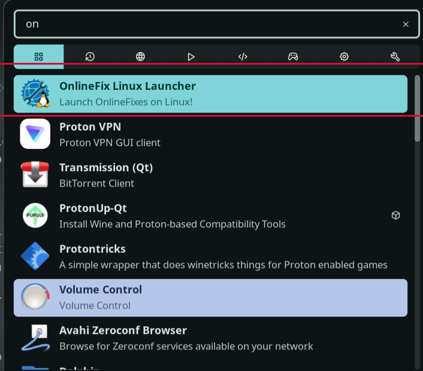

### Step 5: Download Spacewar
You will see Spacewar on Steam. Click "Download" and do not create shortcuts.

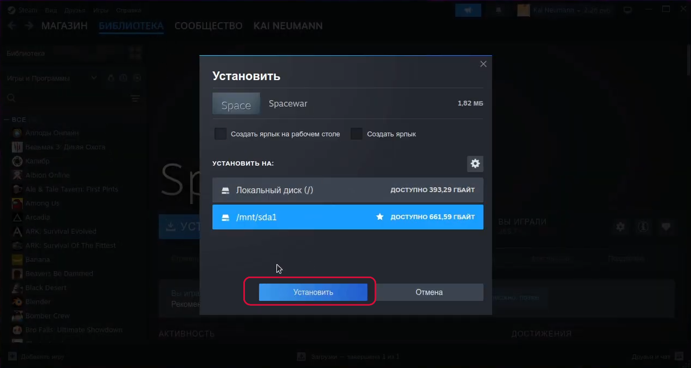

### Step 6: Wait for Download
Spacewar will start downloading.

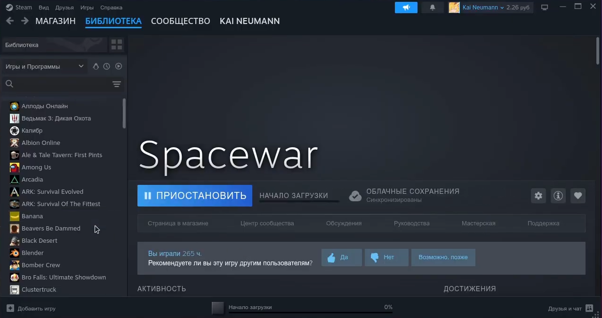

### Step 7: Configure Proton
While downloading, right-click Spacewar in your library and go to **Properties**. Enable the compatibility option and select your Proton version (Proton-Cachy OS is recommended).

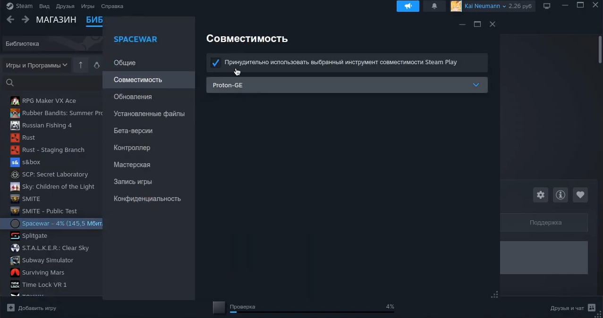

### Step 8: Test the Installation
After the download finishes, open Spacewar. It should open and close automatically. If it doesn't close, close it manually.

## Adding Games via Torrent

### Step 9: Download Games
Download games from torrent sites or the Online-Fix site:
- [Online-Fix](https://online-fix.me/)
- [Torrent-Igruha.net](https://torrent-igruha.net) (includes torrents)

### Step 10: Use qBittorrent
Open qBittorrent and drag your torrent file into it, then click "Download".

> **Note:** Game files are typically setup files. If your game is already set up with an `.exe` file inside, skip to Step 13.

### Step 11: Configure with Lutris
1. Open Lutris and click "Add Game"
2. Select "Add locally installed game"
3. Give it a name and select Wine as the runner

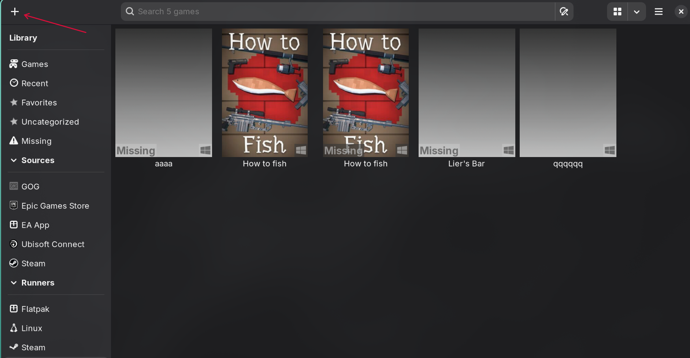
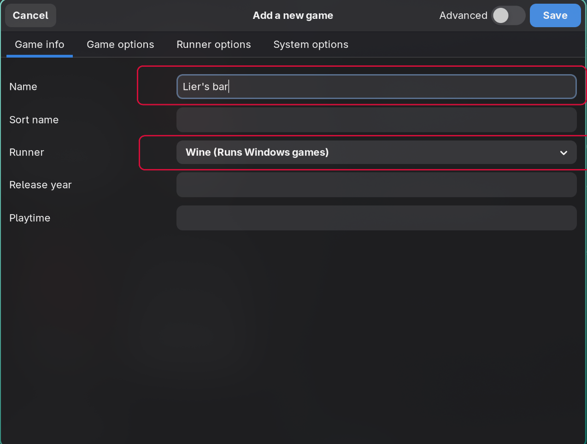

Run the game and download it to the Downloads folder.
- **Default path:** `C:~/home/your_user_name/Downloads`
- **Your path may differ**

### Step 12: Check Downloads Folder
Verify that your game files are extracted in the Downloads folder.

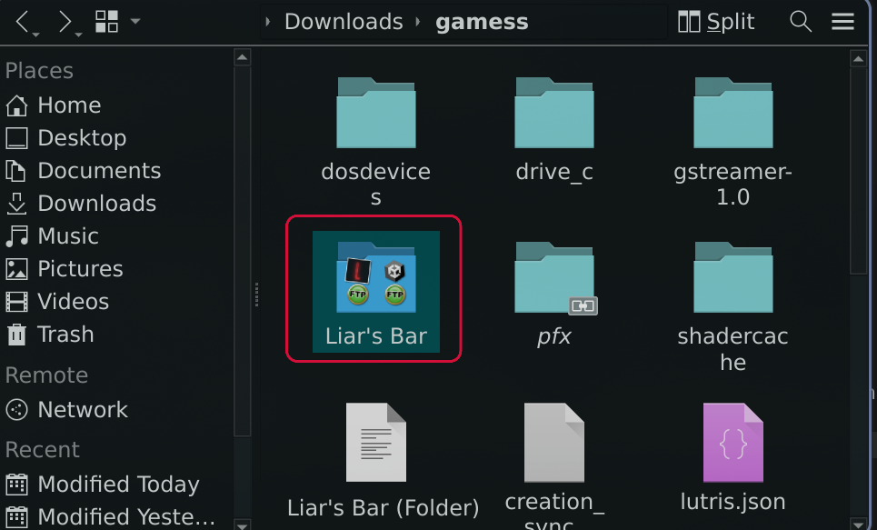

### Step 13: Add Game to Online-Fix
1. Open Online-Fix
2. Click "Add Game" and select your game folder
3. Click "Enter" and it will download and configure automatically
4. Click "Play"

> **Note:** Steam needs to be open for online functionality.

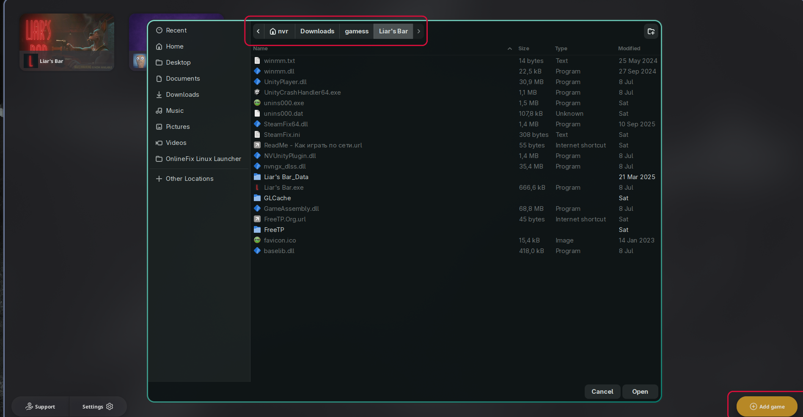

---

> **Troubleshooting:** If Spacewar doesn't show up, open the `.exe` game file via Lutris while Steam is open, then check Steam again.

## Done! Enjoy Your Game
Thank you for using this guide!
